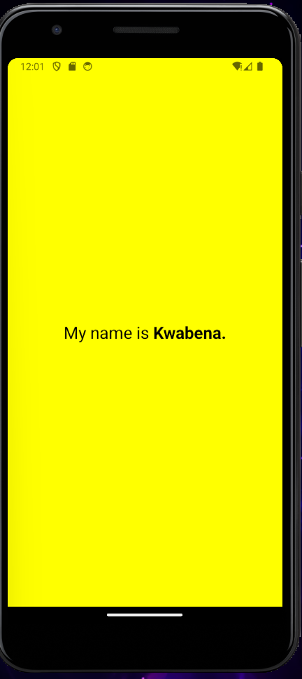

# 11348753

## Task

1. Create a blank react native project with expo.   
2. In the App.js file, change the content of the  Text component to "My name is [your name]" .
3. Change the font size of the Text and make the name bold.
4. Change the background color of the view component.

