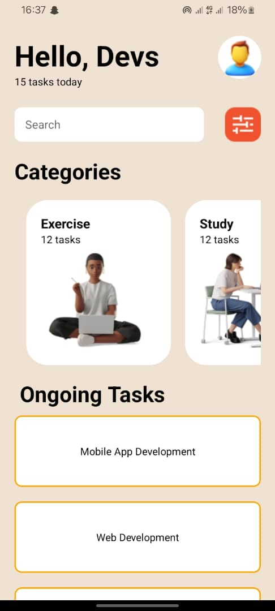

# 11348753 - Phandoh Kwabena Eyiah

## Components 
This App has 6 components.
### Header
The header component displays a welcome message, the users profile as well as the number of tasks to be completed.
### Search
The search component allows  a user to search for specific tasks.
### Categories
The categories component allows the user to filter tasks by category. It displays a list of categories and the number of tasks in each category.
### CategoryItems
This component displays the ui for any specific category.
### OngoingTasks
This component displays a list of the tasks that are yet to be completed.

## Screenshot.
